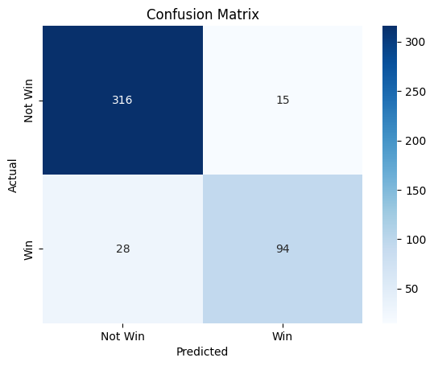

# Indian Elections 2019: Exploratory Data Analysis and Prediction (Streamlit App)

    

## Project Overview

This project dives into the 2019 Indian General Elections—the crown jewel of the democratic process—through **Exploratory Data Analysis (EDA)** and **Machine Learning-based prediction**.

Using datasets from Kaggle:

- Analyze key trends like party performance, voter demographics, and candidate criminal records.
- Predict the outcome of elections using a trained **RandomForestClassifier** with a **90.51% accuracy rate**.
- And now, you can experience the model live via an intuitive **Streamlit-based web app**. No Jupyter notebook wrangling needed. Just run, click, predict.

## Objectives

### Exploratory Data Analysis:
- Visualize constituency distributions across Indian states.
- Analyze win-loss ratios, gender representation, education levels, and criminal backgrounds.
- All visualizations built with Plotly, themed for high contrast and accessibility.

### Predictive Modeling:
- Input candidate info like party, age, education, assets, etc.
- Predict winning chances using a trained RandomForestClassifier.
- Deployed as a **Streamlit app** for live predictions.

## Datasets

### 1. **Indian Candidates for General Election 2019**  
- `LS_2.0.csv`  
- Source: [Kaggle](https://www.kaggle.com/datasets/prakrutchauhan/indian-candidates-for-general-election-2019)  
- Candidate attributes: `PARTY`, `GENDER`, `AGE`, `EDUCATION`, `ASSETS`, `CRIMINAL CASES`, etc.

### 2. **India States (Shapefile)**  
- `Indian_States.shp` (+ `.shx`, `.dbf`, etc.)  
- Source: [Kaggle](https://www.kaggle.com/datasets/somacodes/india-states)  
- Used for choropleth mapping of constituency counts.

## Key Insights

- **Uttar Pradesh** and **Maharashtra** dominate in number of constituencies.
- **BJP** led with ~300 seats; **INC** far behind with ~50.
- **85%+ of winners** are male—gender imbalance is real.
- A concerning number of candidates have **criminal records**, including major party members.
- ML model performance:
  - **Accuracy**: 90.51%
  - **Classification Report**:

    ```
              precision    recall  f1-score   support
           0       0.92      0.95      0.94       331
           1       0.86      0.77      0.81       122
    accuracy                           0.91       453
    ```

  - Confusion matrix:
    
    

## Methodology

### Data Preprocessing:
- Renamed columns (e.g., `CRIMINAL\nCASES` → `CRIMINAL CASES`)
- Filled missing values smartly.
- Cleaned and converted `ASSETS`, `LIABILITIES` to numeric.

### EDA:
- Plotly: Choropleths, sunbursts, Sankey diagrams, bar/pie charts.
- Matplotlib: Basic geospatial plotting.

### Modeling:
- Features: `PARTY`, `AGE`, `GENDER`, `CRIMINAL CASES`, `ASSETS`, etc.
- Model: `RandomForestClassifier` with a `Pipeline` of scaler and encoder.
- Deployed model: `rf_politician_model_pipeline.pkl`.

## Streamlit App: Live Prediction

The prediction tool is now hosted in a Streamlit app for real-time inference.  
Just fire it up locally and input candidate details to predict if they would have won the 2019 election.


## Installation

1. **Clone the Repository**:
```bash
git clone https://github.com/lokesha01hp/Lok_Sabha_2019_EDA_and_Prediction.git
cd Lok_Sabha_2019_EDA_and_Prediction
```

2. **Set Up a Virtual Environment (Recommended)**

```bash
python -m venv venv
venv\Scripts\activate  # On Windows
```

3. **Install Dependencies**

```bash
pip install -r requirements.txt
```

4. **Download & Place Datasets**

Place LS_2.0.csv in:

```bash
datasets/Indian Candidates for General Election 2019/
Place Indian_States.shp (and related .shx, .dbf, etc.) in datasets/India states/Igismap/:
```

5. **Run the Streamlit app**

```bash
streamlit run streamlit_app.py
```


---

### License

This project is licensed under the **MIT License**. See the [LICENSE](LICENSE) file for details.


### Acknowledgments

**Datasets by:**
- Prakrut Chauhan  
- Somacodes (Kaggle)

